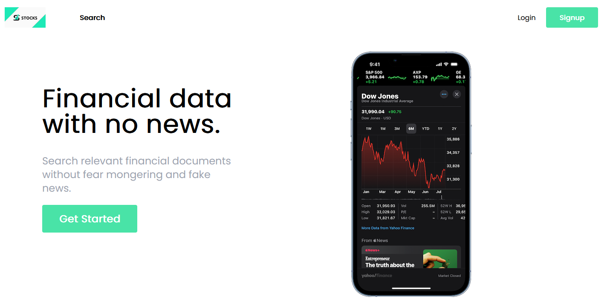
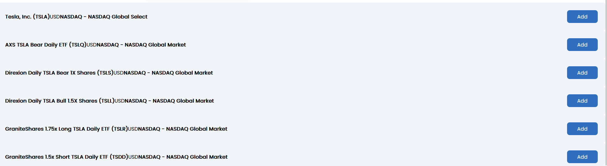
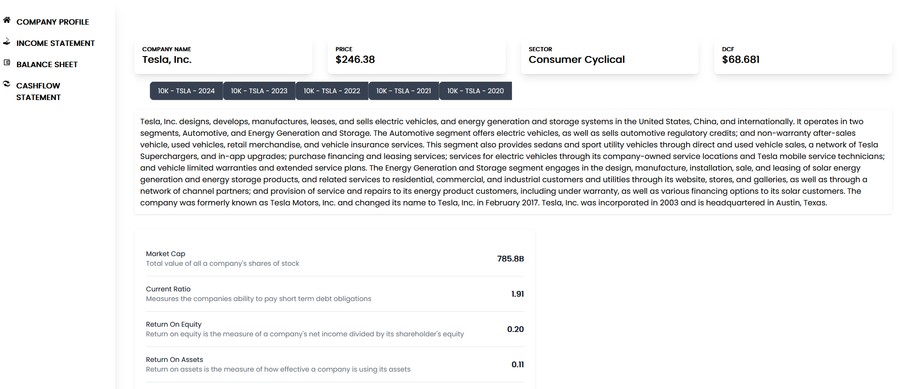

# Stock Finder

Welcome to Stock Finder! This project is a comprehensive platform for searching, analyzing, and managing stocks. It is built with a robust backend using ASP.NET Core and a responsive frontend using React.

## Table of Contents

- [Features](#features)
- [Installation](#installation)
- [Usage](#usage)
- [Screenshots](#screenshots)
- [Contributing](#contributing)
- [License](#license)

## Features

- **User Authentication**: Register and log in to access personalized features.
- **Stock Search**: Search for detailed information about various stocks.
- **Portfolio Management**: Create and manage your own stock portfolios.
- **Comments**: Leave comments and interact with other users about stock trends.

## Installation

### Backend

1. **Clone the repository**
    ```sh
    git clone https://github.com/yourusername/stock-finder.git
    cd stock-finder/backend
    ```

2. **Restore dependencies**
    ```sh
    dotnet restore
    ```
3. **Insert api key in appsettings**

4. **Update the database**
    ```sh
    dotnet ef database update
    ```

5. **Run the backend**
    ```sh
    dotnet run
    ```

### Frontend

1. **Navigate to the frontend directory**
    ```sh
    cd ../frontend
    ```

2. **Install dependencies**
    ```sh
    npm install
    ```
3. **Insert api key in .env**

4. **Run the frontend**
    ```sh
    npm start
    ```

## Usage

Once both the backend and frontend servers are running, open your browser and navigate to `http://localhost:3000`. You can register a new account, log in, and start exploring stocks and managing your portfolio.

## Screenshots

### Home Page


### Search Page


### Company Page


### Portfolio Page


## Contributing

Contributions are welcome! Please fork this repository and submit a pull request for any enhancements, bug fixes, or new features.

## License

This project is licensed under the MIT License. See the [LICENSE](LICENSE) file for details.
